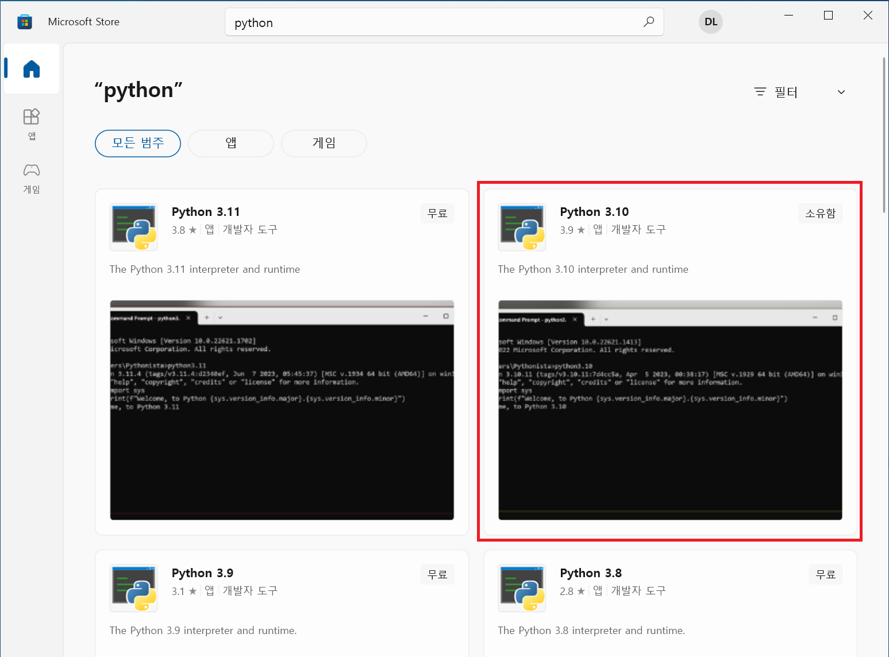
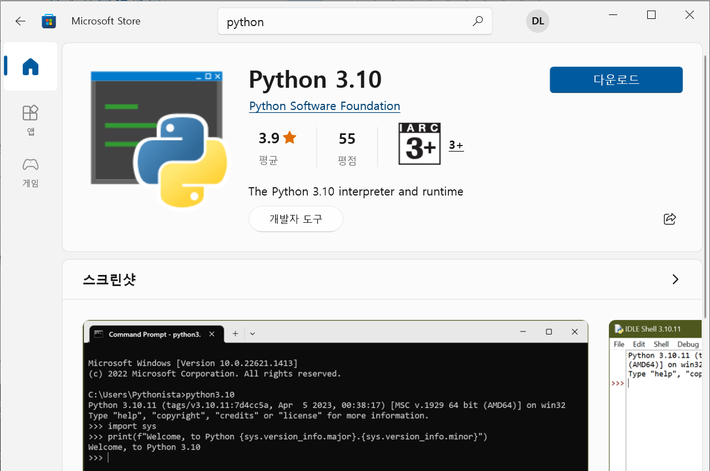

윈도우 환경에서 파이썬 3.10 개발 환경을 구축하는 방법을 알아봅시다.

## 파이썬 설치

1. Microsoft Store를 열고 'python'으로 검색합니다. 검색 결과에서 'Python 3.10'을 선택합니다.

    

    우측의 파란색 '다운로드' 버튼을 클릭해 파이썬 3.10을 설치합니다.
   
   

3. 명령 프롬프트를 실행하고 설치된 파이썬 버전을 확인합니다. 다음과 같이 파이썬 버전이 출력되면 정상적으로 설치된 것입니다.

    ~~~
    $ python --version
    Python 3.10.11
    ~~~

## 파이썬 가상 환경 생성과 활성화

1. 프로젝트 폴더를 생성합니다.

    ~~~
    $ mkdir helloworld
    $ cd helloworld
    ~~~

2. 가상 환경 생성

    다음 명령을 실행해 가상 환경을 생성합니다. 그럼 env 폴더가 만들어지고 해당 폴더에 가상 환경에 필요한 정보가 들어갑니다.

    ~~~
    $ python -m venv env
    ~~~

3. 가상 환경 활성화

    다음 명령을 실행해 가상 환경을 활성화합니다. 

    ~~~
    $ env\Scripts\activate
    ~~~

    가상 환경을 활성화하고 나면 프롬프트의 왼쪽에 가상 환경의 이름이 표시됩니다.

    ~~~
    (env) $ _
    ~~~

4. 다음 명령으로 실제로 격리된 가상 환경인지 확인합니다.

    ~~~
    $ (env) pip list
    Package    Version
    ---------- -------
    pip        23.2
    setuptools 65.5.0
    ~~~

## 가상 환경 비활성화

가상 환경에서 작업이 모두 끝나면 다음 명령을 실행해 가상 환경을 비활성화합니다.

~~~
(env) $ deactivate
$ _
~~~

그럼 가상 환경에서 빠져나와 프롬프트도 원래대로 표시되는 것을 확인할 수 있습니다.
